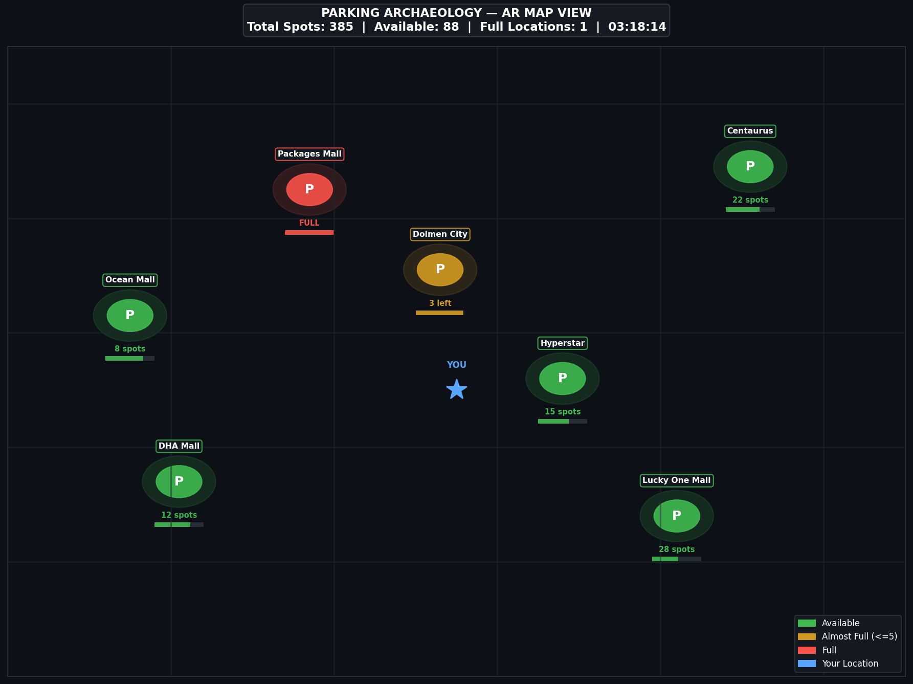
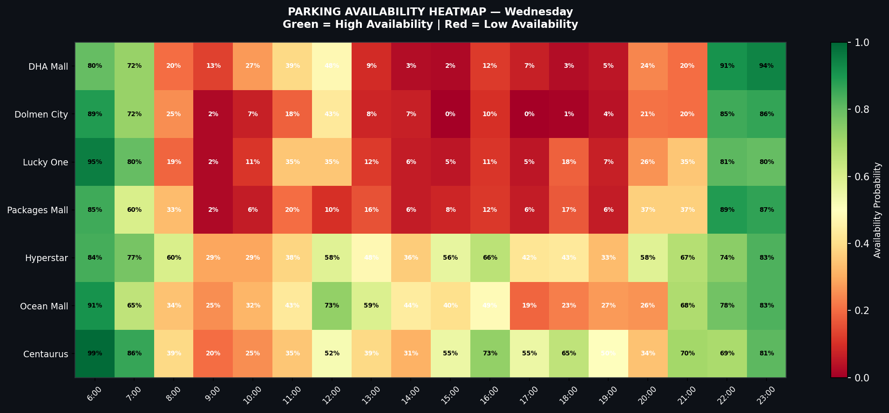
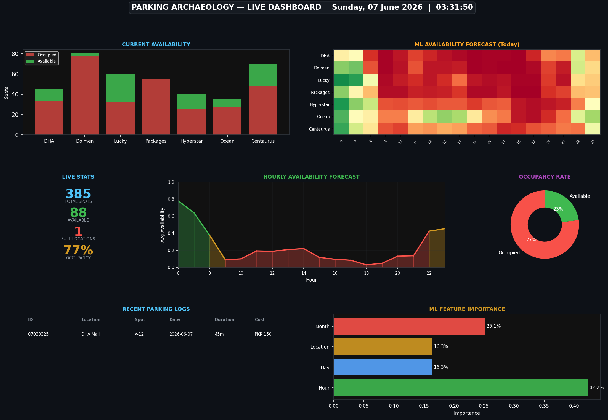
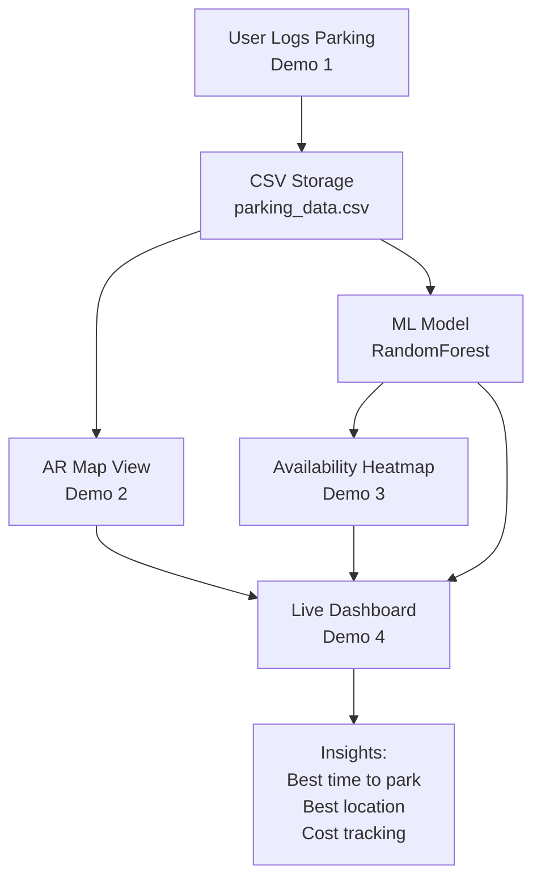

# Parking Archaeology

A smart parking system combining real-time logging, AR-style map visualization, ML prediction, and a live dashboard — all built in Python.

---

## Demo Preview

### AR Map View

### ML Availability Heatmap

### Live Dashboard

---

## System Architecture

---

## Features

Demo 1 — Parking Logger
- Log parking spots with location, time, duration, cost
- View all logs in a clean table
- Show statistics — total cost, favourite spot, total hours

Demo 2 — AR Map View
- Visual map of parking locations
- Color coded availability — green, yellow, red
- Radar chart of availability across locations

Demo 3 — ML Prediction
- RandomForest model trained on parking patterns
- Availability heatmap by hour and location
- Feature importance analysis
- Interactive predictor — enter time and location

Demo 4 — Live Dashboard
- All systems in one view
- Live stats cards
- Hourly forecast curve
- Recent logs table
- Occupancy donut chart

---

## ML Model

Algorithm: Random Forest Classifier
Training samples: 1000
Accuracy: 68 percent

Features used:
- Hour of day (most important — 43 percent)
- Month (24 percent)
- Day of week (16 percent)
- Location (15 percent)

---

## Project Structure

parking-archaeology/
├── scripts/
│   ├── demo_1_parking_logger.py   — Parking logger
│   ├── demo_2_ar_view.py          — AR map visualization
│   ├── demo_3_ml_prediction.py    — ML prediction model
│   ├── demo_4_dashboard.py        — Live dashboard
│   └── requirements.txt           — Python dependencies
├── backend/                       — Express TypeScript API (coming soon)
├── frontend/                      — React Native mobile app (coming soon)
├── docs/                          — Documentation
└── README.md                      — This file

---

## Setup and Run

git clone https://github.com/MIz-1/parking-archaeology.git
cd parking-archaeology/scripts
python3 -m venv venv
source venv/bin/activate
pip install numpy pandas matplotlib scikit-learn plotly

Run demos:
python demo_1_parking_logger.py
python demo_2_ar_view.py
python demo_3_ml_prediction.py
python demo_4_dashboard.py

---

## Roadmap

- [x] Demo 1 — Parking Logger
- [x] Demo 2 — AR Map View
- [x] Demo 3 — ML Prediction
- [x] Demo 4 — Live Dashboard
- [ ] Backend — Express TypeScript REST API
- [ ] Frontend — React Native mobile app
- [ ] Deploy — Cloud hosting

---

## About

Self-taught developer exploring AI and smart city solutions.
Student project — built for learning, not production.